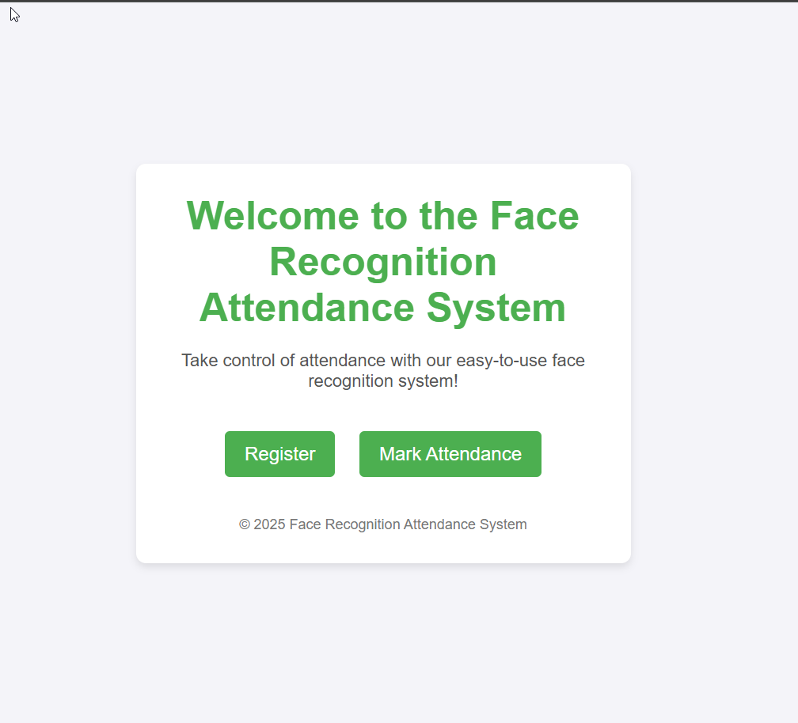
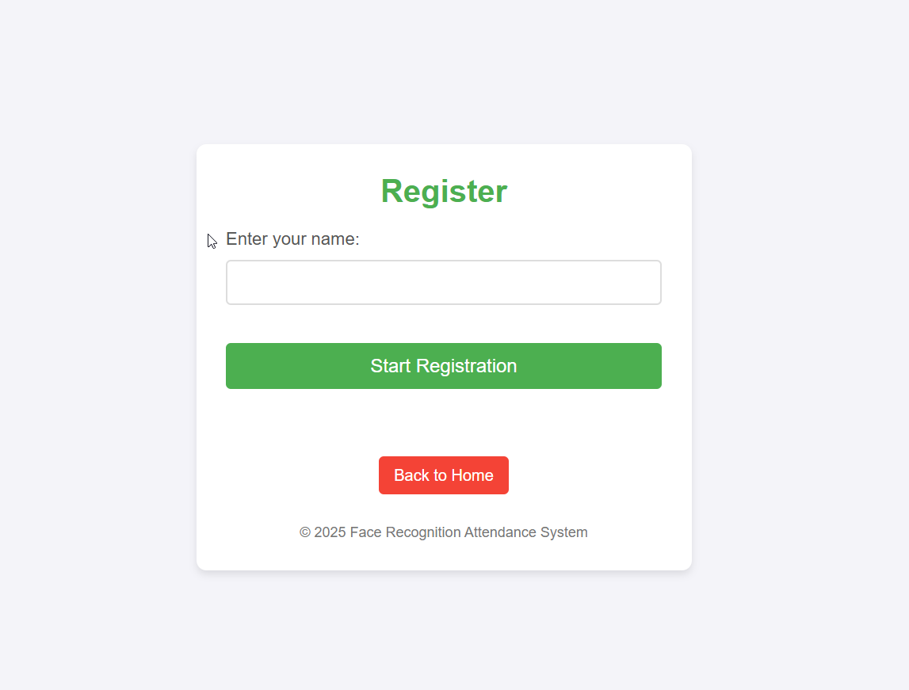
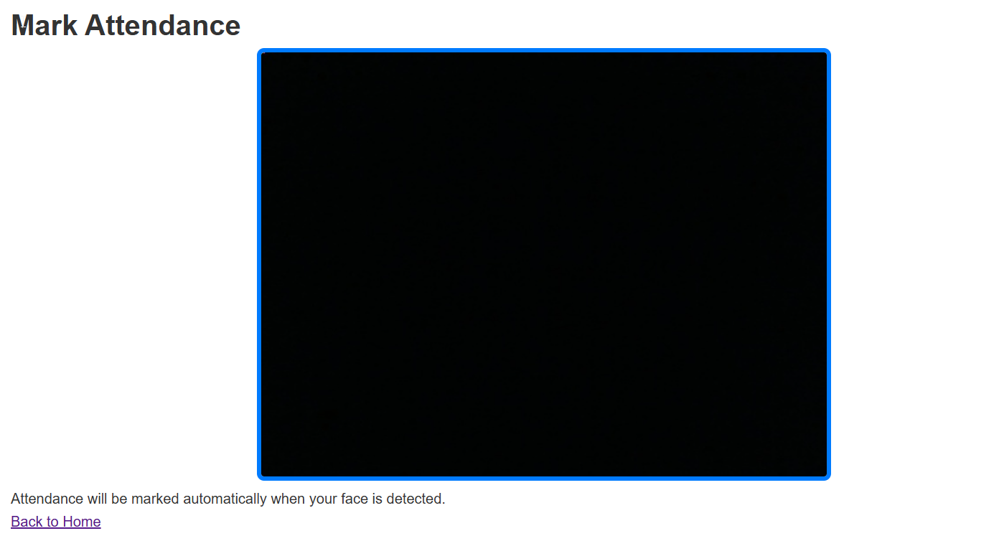

<div align="center" id="top"> 
  

  &#xa0;

  <!-- <a href="https://face_recognition.netlify.app">Demo</a> -->
</div>

<h1 align="center">Automated Attendance System</h1>

<!-- Status -->

<!-- <h4 align="center"> 
	🚧  Face_recognition 🚀 Under construction...  🚧
</h4> 

<hr> -->

<p align="center">
  <a href="#dart-about">About</a> &#xa0; | &#xa0; 
  <a href="#sparkles-features">Features</a> &#xa0; | &#xa0;
  <a href="#rocket-technologies">Technologies</a> &#xa0; | &#xa0;
  <a href="#white_check_mark-requirements">Requirements</a> &#xa0; | &#xa0;
  <a href="#checkered_flag-starting">Starting</a> &#xa0; | &#xa0;
  <a href="#memo-license">License</a> &#xa0; | &#xa0;
  <a href="https://github.com/{{YOUR_GITHUB_USERNAME}}" target="_blank">Author</a>
</p>

<br>

## :dart: About ##

The **Automated Attendance System** is a Python-based application using facial recognition to mark attendance automatically. The system captures faces, stores their embeddings, and matches them in real-time for attendance tracking. The application utilizes OpenCV, Flask, and the `face_recognition` library to detect and recognize faces, and logs attendance to a CSV file.

## :sparkles: Features ##

- **Face Detection & Recognition**: Automatically detects and recognizes faces in real-time using the webcam.
- **Attendance Logging**: Logs the recognized attendance to a CSV file with timestamp.
- **Web Interface**: Flask-based web interface for registering and marking attendance.
- **Real-time Video Feed**: Displays live video feed for face detection.

## Screenshots

### 3.**Home Page**
This is the landing page of the application. It gives the option to navigate to either the register page or the mark attendance page.



### 2. **Register Page**
This is the page where users can register their face for attendance recognition. After clicking "Submit", the system captures the user's face. New window will pop-up press 's' to capture the picture and to exit the window click 'q'.



### 3. **Mark Attendance Page**
This page allows users to mark their attendance by detecting faces in real-time from the webcam. New window will pop-up to exit the window click 'q'.



### 4. **Attendance Log**
After faces are detected and recognized, the system logs the attendance along with the timestamp.

## :rocket: Technologies ##

The following tools were used in this project:

- Python 3.x
- OpenCV
- Flask
- [face_recognition](https://pypi.org/project/face-recognition/) library
- Numpy 1.2.x

## :white_check_mark: Requirements ##

Before starting :checkered_flag:, you need to have [Git](https://git-scm.com) and Python installed.

## :checkered_flag: Starting ##

```bash
# Clone this project
$ git clone https://github.com/Dhairyakhania/Automated-Attendance.git

# Access
$ cd Automated-Attendance

# Install dependencies
$ pip install -r requirements.txt

# Run the project
$ python app.py

# The server will initialize in the <http://localhost:3000>
```

## :memo: License ##

This project is under license from MIT. For more details, see the [LICENSE](LICENSE.md) file.


Made with :heart: by <a href="https://github.com/Dhairyakhania" target="_blank">{{Dhairya Khania}}</a>

&#xa0;

<a href="#top">Back to top</a>
